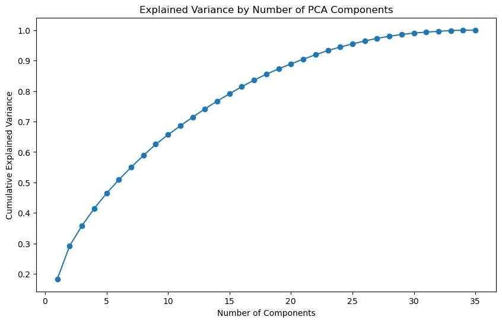
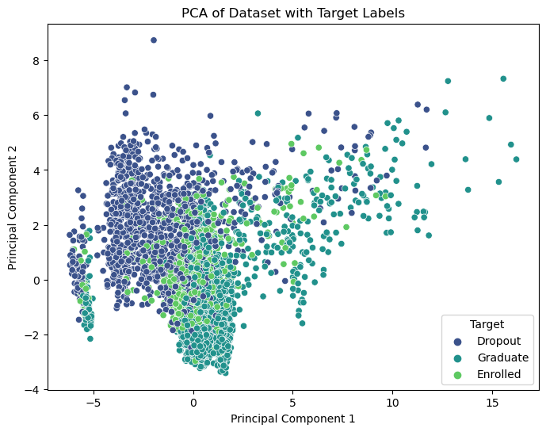
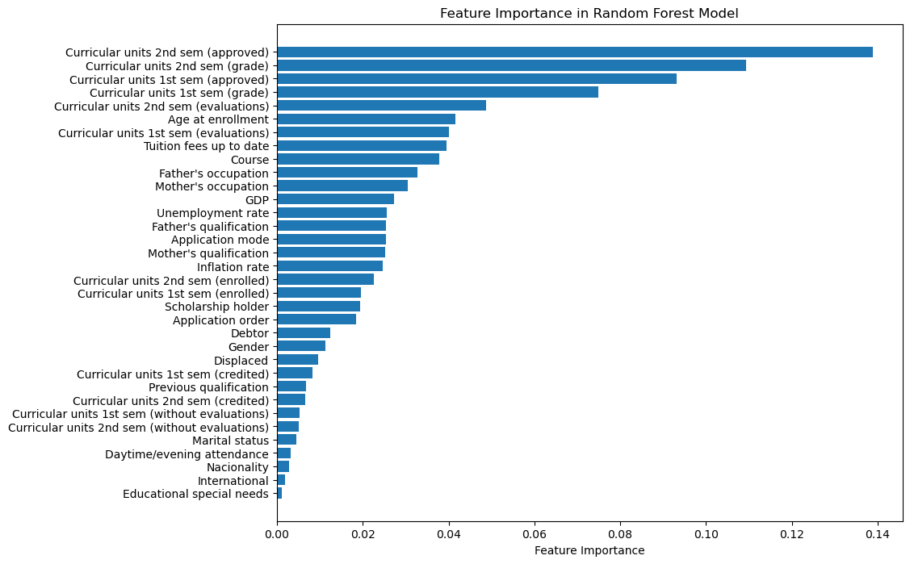
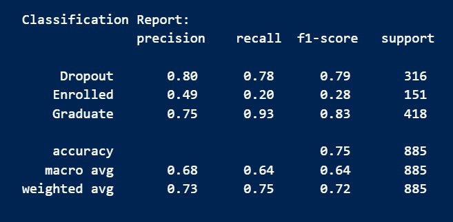
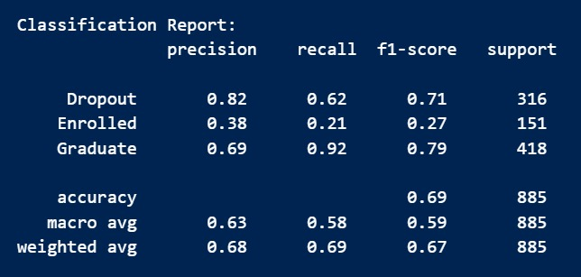
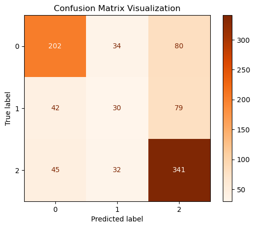

## CS 4641 Project Proposal

### Group 115

## Introduction and Background

Machine Learning has the potential to transform the education industry in several different ways. Particularly, we are interested in the use of ML methods to predict student dropout rates.

Previous work describes “the pipeline built and followed for developing an explainable student dropout prediction system” [1]. Additional research demonstrated that the Logistic Regression model is more accurate and efficient with a **75.63%** accuracy rate in comparison to the K-NN model (**68.907%**) for predicting student dropout rates [2].

In our project, we aim to identify the key academic success factors and predict student dropouts using a Kaggle dataset. The dataset is tabular and contains several features collected at the time of student enrollment, including (but not limited to) marital status, previous grades, and major.

## Problem and Motivation

Thousands of students enroll in universities each year but do not graduate for various reasons. Some large and established universities in the United States report that barely **50%** of incoming freshmen complete their degree. Given the importance of education in society, it is crucial to identify the root causes of this issue and help universities address potential problems before they worsen. Our goal is to accurately predict whether a student is likely to graduate or not, providing valuable insights for university faculty to support students with a higher risk of dropping out.

## Data Processing

- **Exploratory Data Analysis (EDA) & Feature Selection/Engineering**: We will analyze which features provide the most valuable information and identify irrelevant features.
- **Principal Component Analysis (PCA)**: This feature reduction technique will help us boost the most important features and flatten those that do not add value to the prediction model.
- **One-Hot Encoding**: We may need to use this technique to transform categorical features into a format more suitable for machine learning models [3].

## Machine Learning Algorithms/Models

Our dataset contains the target label, making this a supervised learning task. As a baseline for our dropout classification problem, we will use the following models:

- **Random Forest (RandomForestClassifier)**: A robust model for classification tasks.
- **K-Nearest Neighbors (KNN)**: A simple but effective classification algorithm.
- **Logistic Regression (LogisticRegression)**: A popular and effective binary classification model.
- **Gradient Boosting**: We will explore using this ensemble method to improve model performance by combining multiple models [4].

## Results and Discussion

### Metrics

- **Test Accuracy**: We will split the dataset into training and testing sets, with the test set being approximately 20% of the total data. We will evaluate model accuracy on this unseen test data.
- **Precision/Recall**: Given that the dataset is unbalanced, we will use the AUC ROC metric to get a more unbiased view of model performance.
- **Cross-Validation Accuracy**: We will use cross-validation to fine-tune hyperparameters and measure model robustness.

## References

1. Corrêa Krüger J.G. (2023). An explainable machine learning approach for student dropout prediction. _Expert Systems with Applications_. Available at: [https://www.sciencedirect.com/science/article/pii/S0957417423014355](https://www.sciencedirect.com/science/article/pii/S0957417423014355) (Accessed: 28 September 2024).
2. Sharma M. and Yadav M. (2022). Predicting students’ drop-out rate using machine learning models: A comparative study. _IEEE Xplore_. Available at: [https://ieeexplore.ieee.org/document/9917841](https://ieeexplore.ieee.org/document/9917841) (Accessed: 28 September 2024).
3. Documentation of scikit-learn 0.21.3¶ (no date). _Learn_. Available at: [https://scikit-learn.org/0.21/documentation.html](https://scikit-learn.org/0.21/documentation.html) (Accessed: 28 September 2024).
4. XGBoost documentation (no date). _XGBoost Documentation - xgboost 2.1.1 documentation_. Available at: [https://xgboost.readthedocs.io/en/stable/](https://xgboost.readthedocs.io/en/stable/) (Accessed: 28 September 2024).

## Gantt Chart

[View on Google Drive](https://docs.google.com/spreadsheets/d/19o6ZakfyxPPRYyXEH4_JTpknSqOLHHVz/edit?usp=sharing&ouid=112025817987775005881&rtpof=true&sd=true)

## Contributions

| Name               | Contributions                                            |
| ------------------ | -------------------------------------------------------- |
| Aman Patel         | Introduction, Dataset Description, Metrics, Video        |
| Marko Gjurevski    | Gantt Table, Video, Slides, Problem and Motivation Video |
| Rustam Jumazhanov  | Literature Review, GitHub Pages Setup (Jekyll & Docker)  |
| Oleksandr Horielko | Introduction, Literature Review, Reference Section       |
| Aldinash Seitenov  | Data Processing, Machine Learning Algorithms/Model       |

## Video Presentation

<iframe width="560" height="315" src="https://www.youtube.com/embed/C_gpO43Xtxg?si=Y1Oo1im8FzmFBEA3" title="YouTube video player" frameborder="0" allow="accelerometer; autoplay; clipboard-write; encrypted-media; gyroscope; picture-in-picture; web-share" referrerpolicy="strict-origin-when-cross-origin" allowfullscreen></iframe>

# Midterm Checkpoint

## Methods
Our dataset was already clean, so for the data preprocessing step, we performed some encoding operations. First, we used LabelEncoder to transform our target variable (‘Graduate’ or ‘Dropout’) into binary values, where 1 represents Graduate and 0 represents Dropout. We also applied one-hot encoding to categorical features using pandas `get_dummies()` function. We then split our data into training and testing sets, preparing it for our RandomForest model.

We decided to start with the Random Forest model since it’s generally good for handling different types of data and pretty reliable for classification tasks. It also allowed us to see which features from the dataset are the most important (see feature importance plot below), helping us understand the key factors influencing student dropout rates. The ensemble nature of Random Forest also makes it naturally robust against overfitting, which was important given the size of our dataset.

We applied PCA for visualization to make our high-dimensional data easier to understand. By reducing the dataset to a certain number of components, we can see the overall structure and distribution of our target groups (Dropout, Graduate, Enrolled). This helps us explore the data and get a sense of whether the groups are separated or mixed together, which can be useful later on for classification.

While PCA was not necessary for our baseline Random Forest model, it can help us simplify the dataset when we move to models that might struggle with many features (such as KNN which tends to perform better with fewer dimensions). Using PCA to reduce the number of features can make KNN more efficient and possibly improve its accuracy. PCA also helps reduce redundancy by combining correlated features and leaving those that explain the highest variance in the data.

## Results/Discussion

### Discuss the results of your methods and present visualizations and quantitative scoring metrics. What does your visualization/metric tell you?

As part of the EDA of the dataset, we visualized histograms for feature distributions and a correlation matrix for feature relationships. The correlation matrix shows the relationships between different features and the target classes. Strong correlations can indicate which features are closely related to specific outcomes. The histograms show the frequency of data points within specified bins for each feature, allowing comparison across classes. It allows us to better understand the nature of the data, i.e. the distributions of different features and how they relate to each other.
Feature Importance plot reveals which features contribute most significantly to the model's predictions. High-importance features are those that the model relies on heavily to make accurate classifications. 

Our model performed well, achieving an accuracy of 0.77, precision of 0.84, recall of 0.77, and an F1-score of 0.80. By analyzing the feature importance plot, we discovered that curricular units in the 2nd and 1st semesters (both approved and graded) were the strongest predictors of dropout rates. Age, tuition fees, and course also appeared as significant factors, while features like previous qualification, attendance, and nationality showed lower importance.

In our 2-D PCA plot, we see how the three target groups (Dropout, Graduate, and Enrolled) are distributed along the two main components. There’s some overlap, especially between Graduate and Enrolled, which tells us these groups share similar features and may be harder to separate. However, we can see areas where certain groups cluster together, showing that some separation is possible. This gives us a good sense of what we’re working with and what challenges we might face in classification.

### Why did your model perform well/poorly?
Our Random Forest model achieved an accuracy rate of 77%, which is a decently high score. The initial dataset was clean so our model didn’t have to deal with outliers and noisy data. Another reason for high performance is the model itself. Random Forest is a very robust and flexible model since it consists of multiple decision trees that are trained on different subsets of data. Multiple trees help the model avoid overfitting and make it less sensitive to any changes in the dataset.

### What are the next steps you plan to take?
Now that we have a baseline accuracy from our Random Forest Classifier, there are several things we can do to improve upon it. First of all, there are several other types of models we can try training to improve our results, such as Gradient Boosting Classifiers or even Neural Networks. Secondly, we can employ hyperparameter tuning to fine-tune our current Random Forest. There are a couple of key hyperparameters that can be tuned, namely the number of trees used in the model, as well as the number of features from which we select our splitting feature at each tree split. Lastly, we can further process our data and shrink its dimensionality by identifying the most important features. This could be done using PCA, and may improve the results of the training process by eliminating redundant features.

# Final Report
## Methods
### Gradient Boosting
One of the models we chose was a Gradient Boosting method, specifically XGBoost, as it is pretty effective at capturing complex patterns and can handle imbalanced datasets, which is important for our goal of predicting student dropout rates. The algorithm works by building a series of decision trees, where each tree focuses on correcting the errors from the previous ones, optimizing predictions using gradient descent. This model architecture is quite powerful and thus popular in many machine learning competitions.

### Random Forest
Random forest is a very robust and flexible model since it consists of multiple decision trees that are trained on different datasets creating by sampling with replacement. Multiple trees help the model avoid overfitting and make it less sensitive to any changes in the dataset by creating splits on random subsets of features. We chose random forest due to its many benefits listed above and ease of use. 

### Logistic Regression
Logistic Regression is a model that assumes the log-odds of belonging in one class are related linearly to the features. This allows for the model to be easily trained using gradient descent on our data, creating a relatively robust decision boundary. We chose Logistic Regression because it serves as a strong baseline model for classification tasks, offers simplicity, interpretability, and the ability to identify linear relationships between features and the target variable.

### KNN
KNN is a simple model that uses a majority vote of the k-nearest neighbors of a new data point to make a prediction.
The model makes predictions by identifying the k closest data points (neighbors) to a given query point and using their majority class (for classification) or average value (for regression) to determine the outcome. 

The distance metric, such as Euclidean or Manhattan distance, is critical in defining the "closeness" of points, and the choice of k directly impacts the model's performance, with smaller values of k capturing local patterns and larger values generalizing over broader trends.

We chose KNN because of its interpretability and suitability for small to medium-sized datasets where simplicity and flexibility are important. KNN requires no training phase beyond storing the dataset, making it computationally inexpensive during training. It provides a useful benchmark model for comparing performance. 

## Results/Discussion
### Gradient Boosting
Our XGBoost model achieved an initial accuracy of 75.48%, reflecting decent performance given the complexity of the problem and the quality of the features in the dataset. This result improved to 76% after hyperparameter tuning using grid search, which optimized parameters such as the learning rate, maximum tree depth, and the number of estimators. However, the model's performance may still be constrained by the class imbalance in the dataset and noisy features, which could limit its ability to generalize effectively.

### Random Forest
Our Random Forest model achieved an accuracy rate of 77%, which is one of the higher scores. The initial dataset was clean so our model didn’t have to deal with outliers and noisy data. This high score is due to the robustness of the model and the fact that it can train deep trees without overfitting. Below is a visualization of our random forest Feature Importance:

#### Top Contributing Features:

The features at the top of the plot have the highest importance scores, meaning they played the most significant role in the model's predictive performance.
These are things like 2nd Semester Grades and Age at enrollment. 

#### Moderately Important Features:

Mid-ranked features contributed meaningfully but were not as crucial. These might represent secondary relationships or interact with other features to enhance prediction accuracy.

These were things like in inflation rate and gender.

#### Low-Contributing Features:

Features with near-zero importance contributed very little to the model's predictions. These could include redundant, irrelevant, or noisy features. For example, nationality, international status, and whether the student has special needs. 

### Logistic Regression
The baseline Logistic Regression model achieved an accuracy of 75%, demonstrating its effectiveness as a linear classifier and serving as a strong baseline for comparison with more complex models. After applying hyperparameter tuning using cross-validation, we determined that the L1 penalty (lasso regularization) performed better than the default L2 penalty. This suggests that some features in the dataset were less relevant and L1 regularization helped by assigning their coefficients closer to zero. This refinement resulted in a slight performance improvement, with the best model achieving an accuracy of 75.9%.

The high accuracy of the Logistic Regression model can be attributed to the presence of strong linear patterns in the data. These patterns enabled the model to effectively separate the classes without requiring more complex decision boundaries. Additionally, the model’s simplicity and low computational cost made it a reliable choice for initial experimentation and benchmarking.

The confusion matrix revealed areas where the model struggled. This highlights an opportunity for further improvement using techniques like class weighting or oversampling to address imbalances and enhance the model’s ability to generalize to underrepresented classes.

### KNN
The baseline KNN model achieved an accuracy of 64.74%. Then, we applied hyperparameter tuning, and our model experienced a slight increase in the accuracy, reaching 69.37%. As we can see, the adjustment of the number of weights k, distance metrics, weights, and algorithms resulted in an improved performance. It is likely that KNN in this case suffers from the high dimensionality of our data set, known as the curse of dimensionality.Even though hyperparameter tuning slightly boosted the model performance, the number of chosen neighbors could have led to lower performance. We should consider some ways to increase the model accuracy. Possible solutions include better feature selection, taking care of the imbalanced dataset using SMOTE, and more advanced hyperparameter tuning.

### PCA
We applied PCA for visualization to make our high-dimensional data easier to understand. By reducing the dataset to just two main components, we can see the overall structure and distribution of our target groups (Dropout, Graduate, Enrolled) on a simple 2D plot (see below). This helps us explore the data and get a sense of whether the groups are separated or mixed together, which can be useful later on for classification.

While PCA was not necessary for our baseline Random Forest model, it can help us simplify the dataset when we move to models that might struggle with a lot of features (such as KNN that tends to perform better with fewer dimensions). Using PCA to reduce the number of features can make KNN more efficient and possibly improve its accuracy. PCA also helps reduce redundancy by combining correlated features, which might also benefit other models by focusing on the most important parts of the data.
2-D PCA Plot

In our 2-D PCA plot, we can see how the three target groups (Dropout, Graduate, and Enrolled) are distributed along the two main components. There’s some overlap, especially between Graduate and Enrolled, which tells us these groups share similar features and may be harder to separate. However, we can see areas where certain groups cluster together, showing that some separation is possible. This gives us a good sense of what we’re working with and what challenges we might face in classification.

# Comparison
As can be seen from our report, Random Forest provided the best accuracy on the test set among all the models we implemented, achieving 77%. This performance underscores its robustness and ability to handle complex relationships in the data. Compared to Logistic Regression, Random Forest is better suited for capturing non-linear patterns, which likely contributed to its higher accuracy. However, this robustness comes at the cost of interpretability. While the Random Forest feature importance plot provides some insights, the overall model remains more of a "black box" compared to Logistic Regression, which offers clear and interpretable coefficients.

Logistic Regression, achieving 75.9% accuracy after tuning, served as a strong baseline. Its performance demonstrates the presence of linear relationships in the data which makes it a reliable and computationally efficient choice for initial benchmarking. Its inability to capture non-linear patterns limited its predictive power compared to Random Forest and Gradient Boosting.

KNN, with a final accuracy of 69.37% after hyperparameter tuning, struggled the most among the models. Its sensitivity to the high dimensionality of the dataset (the curse of dimensionality) likely impacted its performance. Even after dimensionality reduction using PCA, the model’s accuracy did not improve significantly, highlighting its limitations in handling complex datasets with many features. Additionally, KNN's computational inefficiency during inference further reduces its practicality for larger amounts of data.

Gradient Boosting, specifically XGBoost, performed slightly below Random Forest, achieving an accuracy of 76% after hyperparameter tuning. While XGBoost is adept at handling class imbalance and capturing complex patterns, its performance was slightly constrained by noisy features and the quality of the dataset. XGBoost has the advantage of providing robust results even in challenging scenarios and often requires more tuning compared to Random Forest from what we found.

Lastly, applying PCA revealed limited benefits in terms of classification accuracy for most models. While PCA effectively reduced dimensionality and highlighted the separability of the target groups in the data, the original features already captured important patterns well. Ensemble models like Random Forest and XGBoost, which are naturally capable of handling correlated features, did not see significant performance gains from PCA.

Tldr:

Random Forest: Best overall performance, balancing robustness and accuracy, but less interpretable.

Logistic Regression: Strong baseline with clear interpretability but limited in capturing non-linear relationships.

Gradient Boosting (XGBoost): Strong performance with good handling of imbalanced datasets, slightly lower than Random Forest due to feature quality.

KNN: Struggled with high dimensionality and inefficiency, making it less effective for this dataset.

# Next Steps
There are several things we can do in the future to improve our classification performance. First of all, there are several other types of models we might try training to improve our results, such as Neural Networks and SVM. Secondly, we can employ more sophisticated feature engineering and feature extraction techniques in order to remove multicollinearity in the data and achieve better performance. We can also focus on more advanced hyperparameter tuning and explore what other parameters can influence our models’ performance.

There is a lot that can be done to build off of our work both in terms of the technical aspect of Machine Learning Models but also within the social good space. This work reveals interesting insights into what factors really do tend to contribute or lead to students dropping out. It is important to understand that correlation does not equal causation. We are feeding data into models but that does not account for the complex lives of humans. There is a clear pattern of having certain attributes and being of a certain demographic leading to a higher chance of not finishing your degree. There can be steps taken to ensure that all students are able to see graduation and therefore have a happpy and successful career. 

## Final Report Video Presentation

<iframe width="560" height="315" src="https://www.youtube.com/watch?v=wDphyhVChis" title="YouTube video player" frameborder="0" allow="accelerometer; autoplay; clipboard-write; encrypted-media; gyroscope; picture-in-picture; web-share" referrerpolicy="strict-origin-when-cross-origin" allowfullscreen></iframe>

## Gantt Chart

[View on Google Drive](https://docs.google.com/spreadsheets/d/19o6ZakfyxPPRYyXEH4_JTpknSqOLHHVz/edit?usp=sharing&ouid=112025817987775005881&rtpof=true&sd=true)

## Contributions

| Name               | Contributions                                            |
| ------------------ | -------------------------------------------------------- |
| Aman Patel         | Gradient Boosting, EDA, Metrics, Visualizations          |
| Marko Gjurevski    | Random Forest, EDA, Metrics, Visualizations              |
| Rustam Jumazhanov  | PCA, Metrics, EDA, Visualizations                        |
| Oleksandr Horielko | KNN, Metrics, EDA, Visualizations                        |
| Aldinash Seitenov  | Logistic Regression, Metrics, EDA, Visualizations        |
