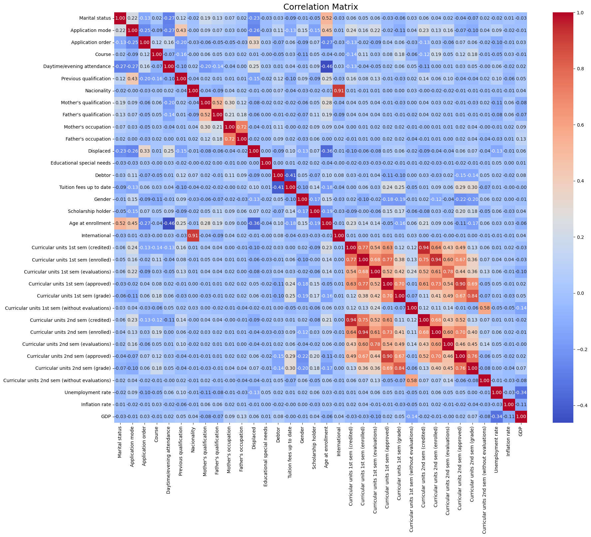

## CS 4641 Project Proposal

### Group 115

## Introduction and Background

Machine Learning has the potential to transform the education industry in several different ways. Particularly, we are interested in the use of ML methods to predict student dropout rates.

Previous work describes “the pipeline built and followed for developing an explainable student dropout prediction system” [1]. Additional research demonstrated that the Logistic Regression model is more accurate and efficient with a **75.63%** accuracy rate in comparison to the K-NN model (**68.907%**) for predicting student dropout rates [2].

In our project, we aim to identify the key academic success factors and predict student dropouts using a Kaggle dataset. The dataset is tabular and contains several features collected at the time of student enrollment, including (but not limited to) marital status, previous grades, and major.

## Problem and Motivation

Thousands of students enroll in universities each year but do not graduate for various reasons. Some large and established universities in the United States report that barely **50%** of incoming freshmen complete their degree. Given the importance of education in society, it is crucial to identify the root causes of this issue and help universities address potential problems before they worsen. Our goal is to accurately predict whether a student is likely to graduate or not, providing valuable insights for university faculty to support students with a higher risk of dropping out.

## Data Processing

- **Exploratory Data Analysis (EDA) & Feature Selection/Engineering**: We will analyze which features provide the most valuable information and identify irrelevant features.
- **Principal Component Analysis (PCA)**: This feature reduction technique will help us boost the most important features and flatten those that do not add value to the prediction model.
- **One-Hot Encoding**: We may need to use this technique to transform categorical features into a format more suitable for machine learning models [3].

## Machine Learning Algorithms/Models

Our dataset contains the target label, making this a supervised learning task. As a baseline for our dropout classification problem, we will use the following models:

- **Random Forest (RandomForestClassifier)**: A robust model for classification tasks.
- **K-Nearest Neighbors (KNN)**: A simple but effective classification algorithm.
- **Logistic Regression (LogisticRegression)**: A popular and effective binary classification model.
- **Gradient Boosting**: We will explore using this ensemble method to improve model performance by combining multiple models [4].

## Results and Discussion

### Metrics

- **Test Accuracy**: We will split the dataset into training and testing sets, with the test set being approximately 20% of the total data. We will evaluate model accuracy on this unseen test data.
- **Precision/Recall**: Given that the dataset is unbalanced, we will use the AUC ROC metric to get a more unbiased view of model performance.
- **Cross-Validation Accuracy**: We will use cross-validation to fine-tune hyperparameters and measure model robustness.

## References

1. Corrêa Krüger J.G. (2023). An explainable machine learning approach for student dropout prediction. _Expert Systems with Applications_. Available at: [https://www.sciencedirect.com/science/article/pii/S0957417423014355](https://www.sciencedirect.com/science/article/pii/S0957417423014355) (Accessed: 28 September 2024).
2. Sharma M. and Yadav M. (2022). Predicting students’ drop-out rate using machine learning models: A comparative study. _IEEE Xplore_. Available at: [https://ieeexplore.ieee.org/document/9917841](https://ieeexplore.ieee.org/document/9917841) (Accessed: 28 September 2024).
3. Documentation of scikit-learn 0.21.3¶ (no date). _Learn_. Available at: [https://scikit-learn.org/0.21/documentation.html](https://scikit-learn.org/0.21/documentation.html) (Accessed: 28 September 2024).
4. XGBoost documentation (no date). _XGBoost Documentation - xgboost 2.1.1 documentation_. Available at: [https://xgboost.readthedocs.io/en/stable/](https://xgboost.readthedocs.io/en/stable/) (Accessed: 28 September 2024).

## Gantt Chart

[View on Google Drive](https://docs.google.com/spreadsheets/d/19o6ZakfyxPPRYyXEH4_JTpknSqOLHHVz/edit?usp=sharing&ouid=112025817987775005881&rtpof=true&sd=true)

## Contributions

| Name               | Contributions                                            |
| ------------------ | -------------------------------------------------------- |
| Aman Patel         | Introduction, Dataset Description, Metrics, Video        |
| Marko Gjurevski    | Gantt Table, Video, Slides, Problem and Motivation Video |
| Rustam Jumazhanov  | Literature Review, GitHub Pages Setup (Jekyll & Docker)  |
| Oleksandr Horielko | Introduction, Literature Review, Reference Section       |
| Aldinash Seitenov  | Data Processing, Machine Learning Algorithms/Model       |

## Video Presentation

<iframe width="560" height="315" src="https://www.youtube.com/embed/C_gpO43Xtxg?si=Y1Oo1im8FzmFBEA3" title="YouTube video player" frameborder="0" allow="accelerometer; autoplay; clipboard-write; encrypted-media; gyroscope; picture-in-picture; web-share" referrerpolicy="strict-origin-when-cross-origin" allowfullscreen></iframe>

# Midterm Checkpoint

## Methods
Our dataset was already clean, so for the data preprocessing step, we performed some encoding operations. First, we used LabelEncoder to transform our target variable (‘Graduate’ or ‘Dropout’) into binary values, where 1 represents Graduate and 0 represents Dropout. We also applied one-hot encoding to categorical features using pandas `get_dummies()` function. We then split our data into training and testing sets, preparing it for our RandomForest model.

We decided to start with the Random Forest model since it’s generally good for handling different types of data and pretty reliable for classification tasks. It also allowed us to see which features from the dataset are the most important (see feature importance plot below), helping us understand the key factors influencing student dropout rates. The ensemble nature of Random Forest also makes it naturally robust against overfitting, which was important given the size of our dataset.

We applied PCA for visualization to make our high-dimensional data easier to understand. By reducing the dataset to a certain number of components, we can see the overall structure and distribution of our target groups (Dropout, Graduate, Enrolled). This helps us explore the data and get a sense of whether the groups are separated or mixed together, which can be useful later on for classification.

While PCA was not necessary for our baseline Random Forest model, it can help us simplify the dataset when we move to models that might struggle with many features (such as KNN which tends to perform better with fewer dimensions). Using PCA to reduce the number of features can make KNN more efficient and possibly improve its accuracy. PCA also helps reduce redundancy by combining correlated features and leaving those that explain the highest variance in the data.

## Results/Discussion

### Discuss the results of your methods and present visualizations and quantitative scoring metrics. What does your visualization/metric tell you?

As part of the EDA of the dataset, we visualized histograms for feature distributions and a correlation matrix for feature relationships. The correlation matrix shows the relationships between different features and the target classes. Strong correlations can indicate which features are closely related to specific outcomes. The histograms show the frequency of data points within specified bins for each feature, allowing comparison across classes. It allows us to better understand the nature of the data, i.e. the distributions of different features and how they relate to each other.
Feature Importance plot reveals which features contribute most significantly to the model's predictions. High-importance features are those that the model relies on heavily to make accurate classifications. 

Our model performed well, achieving an accuracy of 0.77, precision of 0.84, recall of 0.77, and an F1-score of 0.80. By analyzing the feature importance plot, we discovered that curricular units in the 2nd and 1st semesters (both approved and graded) were the strongest predictors of dropout rates. Age, tuition fees, and course also appeared as significant factors, while features like previous qualification, attendance, and nationality showed lower importance.

In our 2-D PCA plot, we see how the three target groups (Dropout, Graduate, and Enrolled) are distributed along the two main components. There’s some overlap, especially between Graduate and Enrolled, which tells us these groups share similar features and may be harder to separate. However, we can see areas where certain groups cluster together, showing that some separation is possible. This gives us a good sense of what we’re working with and what challenges we might face in classification.

### Why did your model perform well/poorly?
Our Random Forest model achieved an accuracy rate of 77%, which is a decently high score. The initial dataset was clean so our model didn’t have to deal with outliers and noisy data. Another reason for high performance is the model itself. Random Forest is a very robust and flexible model since it consists of multiple decision trees that are trained on different subsets of data. Multiple trees help the model avoid overfitting and make it less sensitive to any changes in the dataset.

### What are the next steps you plan to take?
Now that we have a baseline accuracy from our Random Forest Classifier, there are several things we can do to improve upon it. First of all, there are several other types of models we can try training to improve our results, such as Gradient Boosting Classifiers or even Neural Networks. Secondly, we can employ hyperparameter tuning to fine-tune our current Random Forest. There are a couple of key hyperparameters that can be tuned, namely the number of trees used in the model, as well as the number of features from which we select our splitting feature at each tree split. Lastly, we can further process our data and shrink its dimensionality by identifying the most important features. This could be done using PCA, and may improve the results of the training process by eliminating redundant features.

## Gantt Chart

[View on Google Drive](https://docs.google.com/spreadsheets/d/19o6ZakfyxPPRYyXEH4_JTpknSqOLHHVz/edit?usp=sharing&ouid=112025817987775005881&rtpof=true&sd=true)

## Contributions

| Name               | Contributions                                            |
| ------------------ | -------------------------------------------------------- |
| Aman Patel         | Gradient Boosting, EDA, Metrics, Visualizations          |
| Marko Gjurevski    | Random Forest, EDA, Metrics, Visualizations              |
| Rustam Jumazhanov  | PCA, Metrics, EDA, Visualizations                        |
| Oleksandr Horielko | KNN, Metrics, EDA, Visualizations                        |
| Aldinash Seitenov  | Logistic Regression, Metrics, EDA, Visualizations        |
